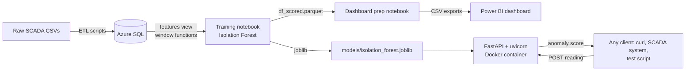
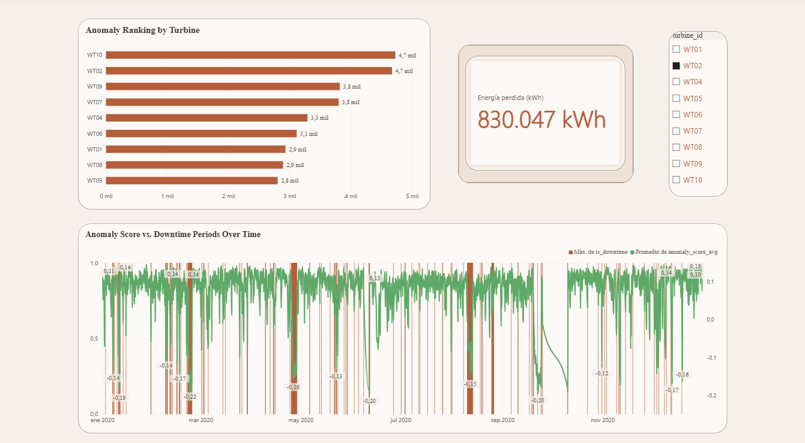
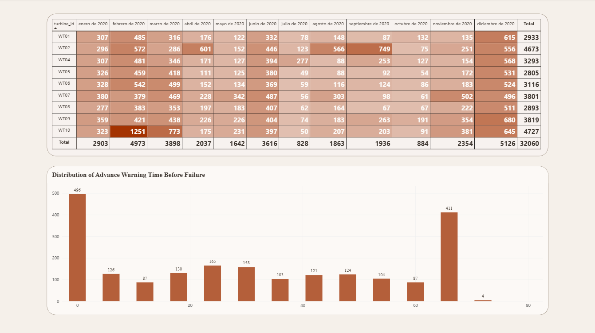

# Wind Turbine Anomaly Monitoring


An end-to-end predictive maintenance pipeline for a wind farm. Real SCADA sensor readings are stored in a cloud database, used to train an unsupervised anomaly detection model, served through a REST API, and summarized in a Power BI dashboard aimed at a non-technical audience.


---

## Why this project

Wind turbines are typically maintained on a fixed schedule or reactively, after a failure already happened. Both are expensive: scheduled maintenance replaces parts that were still fine, and reactive maintenance means the turbine was already down, losing energy production, before anyone noticed.

Predictive maintenance tries to catch early warning signs, a temperature drifting, power output no longer matching wind speed, before a full failure occurs. This project builds a first version of that idea: a model that scores incoming readings, flags the ones that deviate from normal operation, and a dashboard that turns those flags into numbers a manager can act on.

---

## Dataset

Real SCADA data from the Penmanshiel wind farm ([Zenodo, record 16807304](https://zenodo.org/records/16807304)): 13 turbines, 10-minute interval readings, wind speed, power output, temperatures across multiple components (gearbox oil, generator bearings, nacelle), and pitch angles. One turbine (WT03) is excluded due to data quality issues in the original source.

---

## Architecture



The database owns the raw data and the reference power curve. The training notebook only reads from it, trains offline, and produces two outputs: a serialized model for the API, and a scored dataset that a separate notebook aggregates into the tables the dashboard reads. The API loads the model once at startup and answers scoring requests without touching the database, so it stays fast and has no live dependency on Azure SQL once it is running.

---

## Design Decisions

**Feature engineering in SQL, not pandas.** The `features` view (`sql/features.sql`) computes the power curve residual and rolling deltas using SQL window functions directly in Azure SQL. Pulling 447k raw rows into pandas and computing the same rolling windows there would be slower and would not scale if the row count grows; the database is built for this kind of computation.

**Downtime flagging moved from SQL to pandas.** An earlier version tried to flag each reading as downtime with a correlated `EXISTS` subquery in SQL, but it never finished running on the free-tier Azure SQL instance. It was moved to pandas using `merge_asof`, which does the same "is this timestamp inside a known event window" match in-memory in seconds. Documented directly in `sql/features.sql` so the reasoning is not lost.

**Isolation Forest over a supervised classifier.** There is no reliable set of labeled failure examples in this dataset, only a handful of logged stop/warning events, and a good chunk of those are routine wind cut-out stops rather than real faults, so the label is noisy even where it exists. Isolation Forest is trained only on confirmed normal-operation readings (`is_downtime == 0`) and learns what normal looks like; anything that does not fit gets flagged. No failure labels are needed for training, and the model can in principle catch a failure mode it has never seen before, something a supervised model trained on past failures cannot do.

**Feature selection by correlation, not by throwing everything in.** Before training, a correlation matrix was checked to drop redundant columns: `power_avg`, `expected_power` and the moving averages are all >0.9 correlated with `wind_speed_avg` (they encode the same information), and `front_bearing_temp` / `rear_bearing_temp` are >0.93 correlated with `gear_oil_temp`. Keeping all of them would not add information, just duplicate signal and make the model's isolation splits less meaningful. Final set: 9 features, listed below.

**In-memory per-turbine history in the API, with the tradeoff documented in code.** Two features (`power_avg_delta`, `wind_speed_avg_delta`) need the previous reading. The API keeps a small in-memory store per turbine instead of a database round trip on every request, which keeps scoring fast, at the cost of losing history on restart. This is called out explicitly in `src/api/store.py` and in Known Limitations below; it is a reasonable tradeoff for a single-instance demo, not for a multi-instance production deployment.

**Docker for the serving layer.** The model is serialized with `joblib`, which ties it to the exact scikit-learn version used to train it (a version mismatch can silently change predictions, not just throw an error). Packaging the API with pinned dependency versions (`requirements-api.txt`) guarantees it runs identically regardless of what is installed on the host machine.

---

## Model Validation

The model is unsupervised, so it was never told what a failure looks like. It is checked against the known downtime events (stop/warning/communication) as an external sanity check, not as a training signal.

| Metric | Value | What it means |
|---|---|---|
| Readings flagged anomalous | 32,060 / 446,306 (7.2%) | Overall anomaly rate across the full dataset. |
| Recall vs. known downtime | 5,873 / 11,206 (52.4%) | Of readings inside a confirmed downtime window, the model flags about half as anomalous. |
| Overlap with known downtime | 5,873 / 32,060 (18.3%) | Of everything flagged as anomalous, only 18% corresponds to a logged event. |

Neither number is a failure of the model, and both need context to be read correctly.

The 52.4% recall looks unimpressive until you remember what `is_downtime` actually contains: not just real faults, but also routine wind cut-out stops, which are a safety-driven, intentional shutdown and have no reason to look anomalous in the sensor readings. A model that flagged those as anomalies would be wrong, not right. Splitting downtime causes apart to measure recall only against genuine faults is the clearest next step to make this number meaningful.

The 18.3% overlap is low for a similar reason in the other direction: most flagged anomalies happen with no downtime event attached at all, and that is largely the point of the model. It is meant to catch degradation before it turns into an official stop, or to flag sensor combinations that never escalate into a logged fault. Some of that 82% is also plain false positives, concentrated at wind speed extremes where the reference power curve has fewer training samples per bin (documented in `src/api/scoring.py`).

---

## Dashboard

Power BI report built on top of `df_scored.parquet` (the same scored dataset the model validation above comes from), aggregated by `notebooks/05_dashboard_prep.ipynb` into a few small CSV tables so Power BI is not stuck importing 446k raw rows for numbers that only need to be seen at the turbine or month level.

Three business questions drove what got built, deliberately picked to be questions a non-technical manager would actually ask, not "what is the model's F1 score":

1. Which turbines are causing the most trouble?
2. How much has this actually cost, in energy?
3. Does the system give any real warning before a turbine goes down, or does it only confirm what already happened?



**Anomaly Ranking by Turbine** (top left): total anomalous readings per turbine across the whole dataset. WT10 and WT02 lead with around 4,700 each.

**Total Energy Lost to Downtime** (top center): 830,047 kWh, computed only from confirmed downtime periods, as `max(0, expected_power - power_avg)` per 10-minute reading, converted from kW to kWh. Deliberately restricted to confirmed downtime rather than every anomalous reading, so the number stays defensible: it represents energy known to be lost, not a speculative estimate stacked on top of the model's own uncertainty.

One thing worth noticing here, and it is the kind of detail that actually matters: WT02 is not the turbine with the most anomalies (it is second, behind WT10), but it is the turbine with by far the most energy lost. Counting anomalies and counting cost are two different questions, and a maintenance team with limited time should probably be told to look at WT02 first, not whichever turbine has the highest anomaly count.

**Anomaly Score vs. Downtime Periods Over Time** (bottom): the green line is the average anomaly score for a selected turbine (filterable with the slicer on the right), the red bars mark confirmed downtime. Lower on the green line means more anomalous. Visually, several of the sharpest drops in the line line up with a red bar, which is the qualitative version of the recall number above.



**Monthly Anomaly Distribution by Turbine** (top): a matrix colored by anomaly count, turbine by month. This surfaces patterns a single yearly total hides, for example WT02 spiking to 749 anomalies in September while sitting at 75 in October.

**Distribution of Advance Warning Time Before Failure** (bottom): for every confirmed downtime event, the notebook looks back up to 72 hours and finds the first *persistent* anomaly (three consecutive anomalous readings, the same rule the API itself uses for `anomaly_persistent`, not a single anomalous reading which is far more likely to be noise). Out of 2,772 downtime events, 2,116 (76.3%) had a persistent anomaly warning at some point in the preceding 72 hours; 656 (23.7%) had none.

That 76.3% is the single most useful number in the whole project, but it needs one honest caveat spelled out, because the raw version of it is misleading. Simply asking "was there any anomaly, ever, in the 72 hours before" gives a much higher, inflated number: with the model's own background noise rate, a fixed 72-hour backward search is statistically biased toward finding *something* near the edge of that window regardless of whether a real failure is approaching, purely because of how far back the search happens to reach. That is visible in the histogram itself: there is a tall bar right at the 66-72h edge that does not fit the otherwise smooth, decreasing shape of the rest of the distribution. Requiring three consecutive anomalies instead of one cuts this bias down a lot (raw anomalies: 32,060, persistent anomalies: 22,134) but does not remove it completely, since the same edge effect still applies at a lower rate. The honest reading of this chart is: most real warnings arrive in the last few hours before a failure (496 events in the 0-6h bin), a meaningful number arrive with a day or more of notice (roughly 100-165 events per 6-hour bin between 6h and 60h), and the tall bar at the far right edge should be treated with more skepticism than the rest of the chart, not taken as "many failures gave 3 days of notice."

**What this dashboard does not claim.** It would be tempting to multiply 830,047 kWh by "the model gives advance warning most of the time" and announce a savings figure. That number does not exist here on purpose: turning advance warning into avoided losses requires knowing how fast a maintenance team would actually respond, whether early intervention prevents the stop or only shortens it, and which downtime causes are even preventable (a wind cut-out is not a fault to fix). None of that is in this dataset. The dashboard reports what happened and what the model detected; it does not extrapolate a return-on-investment number it cannot support.

---

## The API

Built with FastAPI, served with uvicorn, packaged with Docker.

**`GET /health`**: confirms the process is alive and responding. Does not check the model or its dependencies.

**`POST /readings/score`**: accepts one SCADA reading, returns whether it looks anomalous.

```bash
curl -X POST http://localhost:8000/readings/score \
  -H "Content-Type: application/json" \
  -d '{
    "turbine_id": "WT04",
    "ts": "2020-01-01T08:40:00",
    "wind_speed_avg": 3.156063,
    "power_avg": -0.479439,
    "gear_oil_temp": 53.106667,
    "gen_bearing_front_temp": 41.111668,
    "gen_bearing_rear_temp": 37.939999,
    "nacelle_temp": 18.530001
  }'
```

```json
{
  "turbine_id": "WT04",
  "ts": "2020-01-01T08:40:00",
  "anomaly": false,
  "anomaly_score": 0.119270187223039,
  "anomaly_persistent": false,
  "insufficient_history": false
}
```

`anomaly_score` follows scikit-learn's convention: positive means "typical", negative means "isolated fast, likely anomalous". `insufficient_history: true` means this is the first reading seen for that turbine since the API started, so there is nothing yet to compute a delta against; it gets stored, not scored. `anomaly_persistent` is the same three-in-a-row rule used to build the lead time chart above.

Model features used, in the exact order the model expects:

`wind_speed_avg`, `power_residual`, `power_residual_pct`, `power_avg_delta`, `wind_speed_avg_delta`, `gear_oil_temp`, `gen_bearing_front_temp`, `gen_bearing_rear_temp`, `nacelle_temp`.

---

## Project Structure

```
wind-turbine-monitoring/
├── sql/
│   ├── schema.sql                  # turbines, readings, events tables
│   └── features.sql                # power_curve_reference and features views
├── src/
│   ├── etl/                         # loads raw CSVs into Azure SQL
│   └── api/
│       ├── main.py                  # FastAPI app, routes
│       ├── schemas.py               # request / response models (Pydantic)
│       ├── scoring.py               # feature computation + model inference
│       └── store.py                 # in-memory per-turbine history
├── notebooks/
│   ├── 01_exploration.ipynb
│   ├── 02_feature_review.ipynb
│   ├── 03_model_training.ipynb
│   ├── 04_anomaly_validation.ipynb
│   └── 05_dashboard_prep.ipynb      # aggregates df_scored.parquet into dashboard CSVs
├── models/
│   └── isolation_forest.joblib
├── dashboards/
│   ├── wind-turbine-monitoring-dashboards.pbix   # the Power BI report itself
│   ├── theme.json                   # Power BI light theme
│   ├── theme-dark.json              # Power BI dark theme
│   └── images/                      # dashboard screenshots used in this README
├── data/                            # raw and processed data, not committed
├── Dockerfile
├── requirements.txt                 # full environment (notebooks + ETL)
└── requirements-api.txt             # pinned, minimal set for the API image
```

---

## Running it locally

Requires Docker Desktop.

```bash
git clone https://github.com/carlosgomezaparicio/wind-turbine-monitoring.git
cd wind-turbine-monitoring

#Build the API image
docker build -t wind-turbine-api .

#Run it
docker run -d --name wind-turbine-api -p 8000:8000 wind-turbine-api

#Check it is up
curl http://localhost:8000/health

#Stop and remove when done
docker stop wind-turbine-api
docker rm wind-turbine-api
```

To reproduce the training pipeline instead of just running the API, install `requirements.txt` in a virtual environment, set the Azure SQL credentials in a `.env` file (`DB_SERVER`, `DB_NAME`, `DB_USER`, `DB_PASSWORD`), and run the notebooks in order (`01` through `05`). The Power BI report itself is included at `dashboards/wind-turbine-monitoring-dashboards.pbix`, open it directly in Power BI Desktop; `05_dashboard_prep.ipynb` produces every CSV it reads, and `dashboards/theme.json` / `theme-dark.json` reproduce its color scheme if you want to rebuild it from scratch.

---

## Known Limitations

Being upfront about what this does not solve yet:

- **In-memory history.** The per-turbine history used for delta features lives in the API process memory. A restart clears it, and it would not work correctly across multiple API instances behind a load balancer. A production version would back this with Redis or a database table, as noted directly in `src/api/store.py`.
- **No automated tests.** The API and scoring logic were verified manually, including against real historical readings, not synthetic ones, but there is no `pytest` suite yet.
- **No model versioning or retraining pipeline.** The model was trained once on the available historical data, with no tracking of versions or scheduled retraining.
- **Moderate recall against known downtime (52.4%), inflated by a noisy label.** `is_downtime` mixes real faults with routine wind cut-out stops that should not be expected to look anomalous. Separating those two causes would give a recall number that actually reflects fault detection instead of being dragged down by stops the model was never supposed to catch.
- **The lead time histogram has a known edge bias.** As explained in the Dashboard section, the bar at the 66-72h boundary is inflated by how the 72-hour lookback window interacts with the model's background noise rate, not by a genuine 3-day-ahead warning signal. It is left visible in the chart with the caveat documented here rather than silently trimmed.

---

## Tech Stack

| Layer | Technology |
|---|---|
| Database | Azure SQL |
| ETL | Python, SQLAlchemy, pyodbc |
| Data analysis / modeling | pandas, scikit-learn, matplotlib |
| Model | Isolation Forest (unsupervised) |
| Model serialization | joblib |
| API | FastAPI, uvicorn, Pydantic |
| Containerization | Docker |
| Dashboard | Power BI, Power Query |
| Environment | Jupyter Notebook |

---

Carlos Gomez Aparicio · [LinkedIn](https://www.linkedin.com/in/carlos-gomez-aparicio/) · [GitHub](https://github.com/carlosgomezaparicio)
